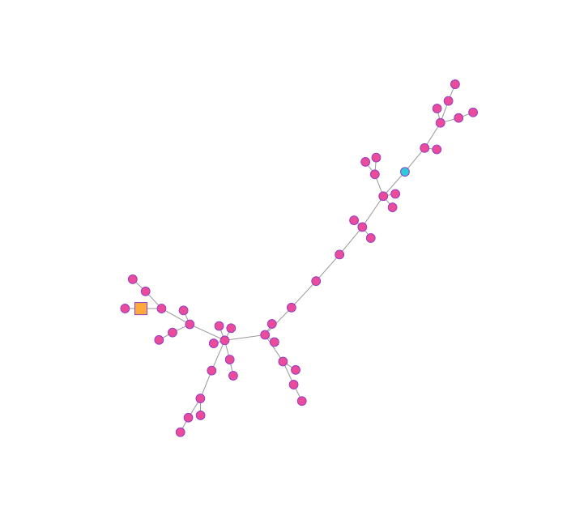

# TBRW - Tree Builder Random Walk

`tbrw` is an R package for simulating the Tree Builder Random Walk, a random walk process that builds its own tree. The package provides functionality such as generating the adjacency list of the tree generated after n steps, keeping track on the distance and the degree of vertices the walker sees as it walks. We recommend using `igraph` to plot the tree



## Installation

You can install the development version of `tbrw` from [GitHub](https://github.com/rbribeiro/tbrw) with:

```r
# Install devtools if you haven't already
# install.packages("devtools")

# Install myPackage
devtools::install_github("rbribeiro/tbrw")


